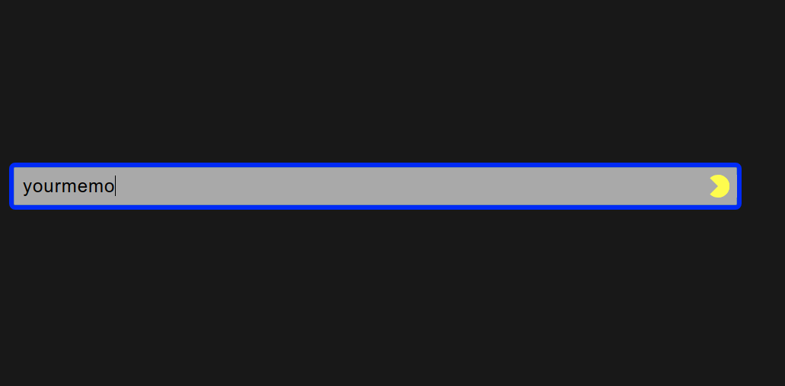

# Secure password generator script
 

That uses a phrassphrase proccessed with sha1sum and ascii85 and paste in place the generated password.



## Installation

Ubuntu:

```sh
sudo apt-get install xdotool xsel xclip
```
chmod +x pass
sudo mv pass /usr/local/bin

Go to system settings -> Keyboard -> Shortcuts -> Add a custom shortcut and assign a key to it.

## Usage example

When you create a website account, use your password, select it and apply the script. You can see the result.

## Release History

* 0.1
    * First Release.

## Meta

César R. Cid Méndez – [@YourTwitter](https://twitter.com/skypce) – skypce@gmail.com

Distributed under the GPL license. See ``LICENSE`` for more information.

[https://github.com/skypce/secure-passwords-script](https://github.com/skypce/secure-passwords-script)

